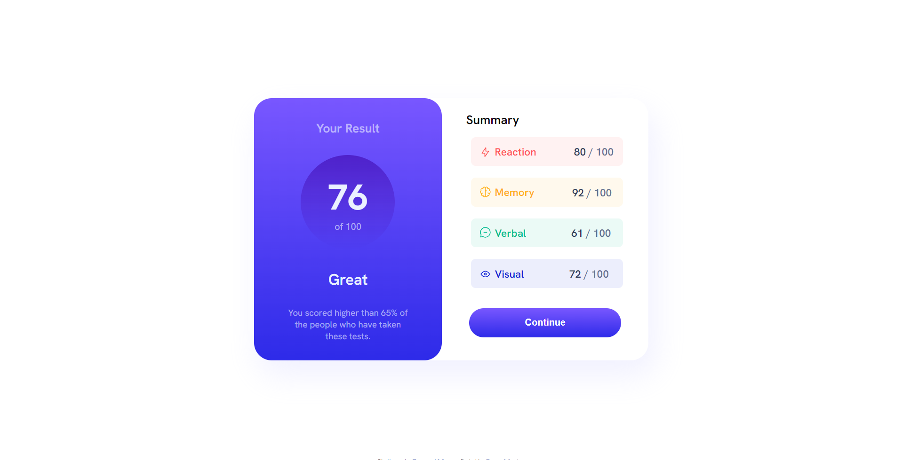
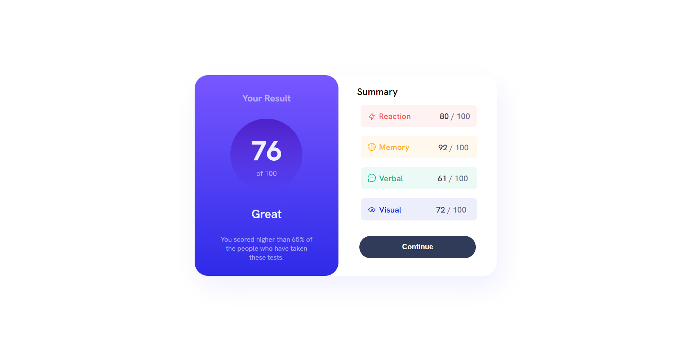

# Frontend Mentor - Solução do Results summary component challenge

Esta é uma solução para o desafio [Componente de resumo de resultados no Frontend Mentor](https://www.frontendmentor.io/challenges/results-summary-component-CE_K6s0maV).

## Sumário

- [O desafio](#the-challenge)
- [Capturas de tela](#screenshot)
- [Desenvolvido com](#built-with)
- [Autor](#author)

### O desafio

O desafio era desenvolver esse componente de resumo de resultados e deixá-lo o mais próximo possível do design.

Os usuários deveriam ser capazes de:
- Visualizar o layout ideal para a interface, dependendo do tamanho da tela do seu dispositivo.
- Ver os estados de hover e foco para todos os elementos interativos na página.

### Screenshot

Este é o design oficial:

- Botão ativado 

- Preview do desktop 

- Design mobile 

Esta é a minha solução:

- 

- 

- 

### Desenvolvido com:
- HTML5
- CSS3
- Flexbox

## Author
- Github - [Bruno Martins](https://github.com/3runoAM)
- Frontend Mentor - [@3runoAM](https://www.frontendmentor.io/profile/yourusername)